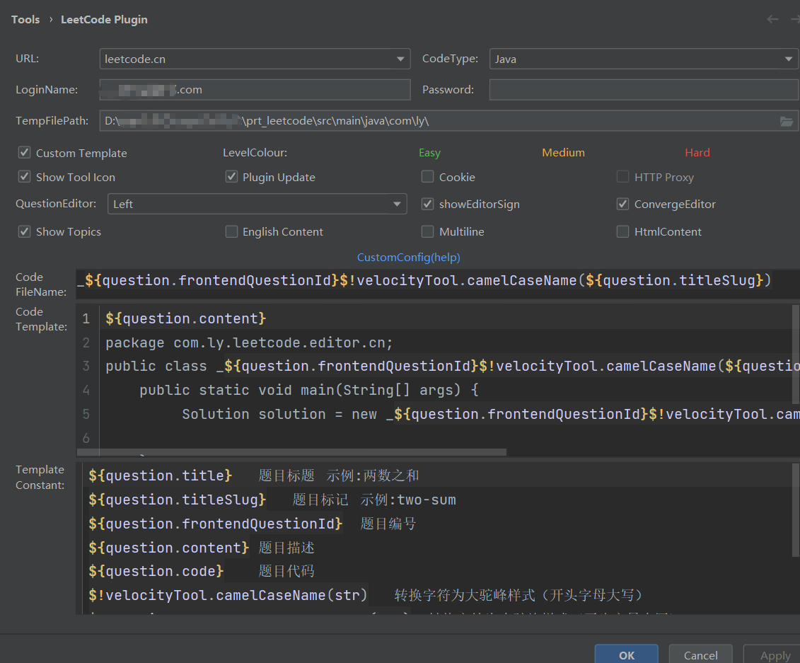

# prt_leetcode
leetcode-idea解题备份
## idea的LeetCodePlugin插件设置


1. CodeFileName

   ```java
   _${question.frontendQuestionId}$!velocityTool.camelCaseName(${question.titleSlug})
   ```

2. CodeTemplate

   ```java
   ${question.content}
   package com.ly.leetcode.editor.cn;
   public class _${question.frontendQuestionId}$!velocityTool.camelCaseName(${question.titleSlug}){
       public static void main(String[] args) {
            Solution solution = new _${question.frontendQuestionId}$!velocityTool.camelCaseName(${question.titleSlug})().new Solution();
            
       }
       ${question.code}
   }
   ```

3. TemplateConstant

   ```java
   ${question.title}	题目标题	示例:两数之和
   ${question.titleSlug}	题目标记	示例:two-sum
   ${question.frontendQuestionId}	题目编号
   ${question.content}	题目描述
   ${question.code}	题目代码
   $!velocityTool.camelCaseName(str)	转换字符为大驼峰样式（开头字母大写）
   $!velocityTool.smallCamelCaseName(str)	转换字符为小驼峰样式（开头字母小写）
   $!velocityTool.snakeCaseName(str)	转换字符为蛇形样式
   $!velocityTool.leftPadZeros(str,n)	在字符串的左边填充0，使字符串的长度至少为n
   $!velocityTool.date()	获取当前时间
   ```

   